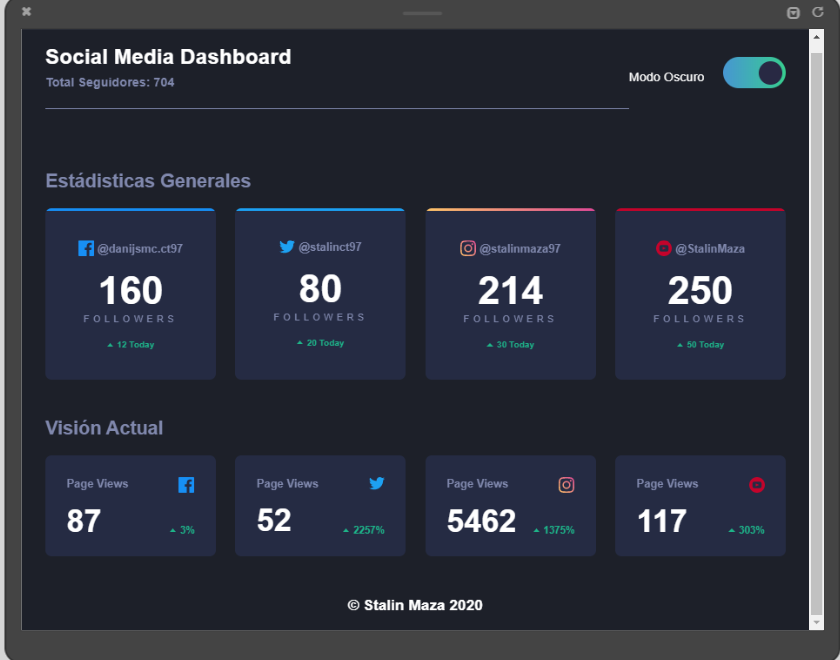
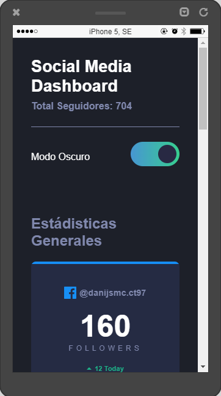
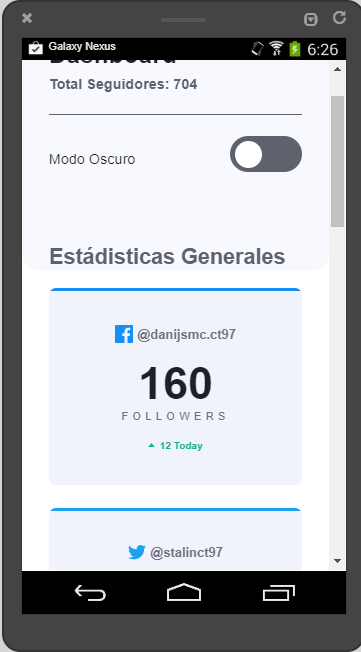

# Dashboard Responsive con React Hooks #

Ejercicio para aplicar ReactJS a un pequeño ejemplo usando React Hooks y aplicando variables con CSS para la interactividad entre el modo oscuro y claro.

El ejercicio abarca lo siguiente:
- Diseño Responsive
- Maquetacion HTML
- React Hooks

## Cómo usarlo?

- Clonar el proyecto o descargarlo
- En el directorio donde este el proyecto clonado o descomprimido abrir una terminal y ejecutar el comando "npm install"
- Hecho esto ejecutar el comando "npm run start o yarn start" para iniciar el proyecto en modo desarrollo

## Imágenes

**Modo Escritorio**

**Modo Móvil (Iphone)**

**Modo Móvil (Android)**

## Autor & Créditos
Este ejemplo fue explicado por el Profesor Leonidas Esteban en un curso básico de 3 horas en su canal de youtube.

Algunos cambios fueron aplicados por mi, pero la mayoría de los créditos son para el autor del video con el cual se basa este ejercicio

